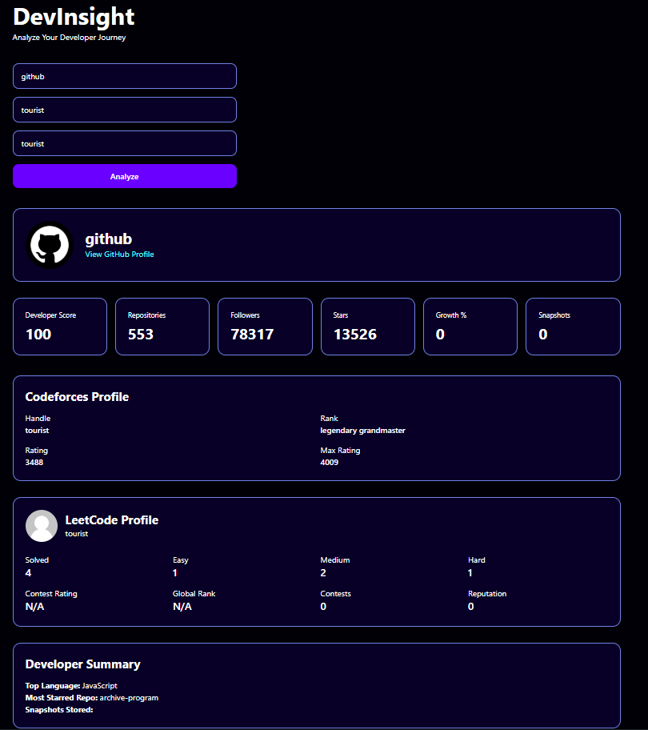
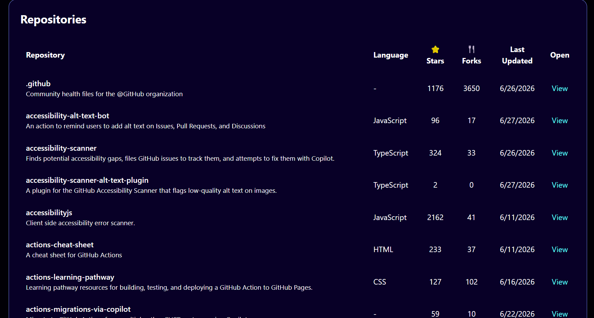
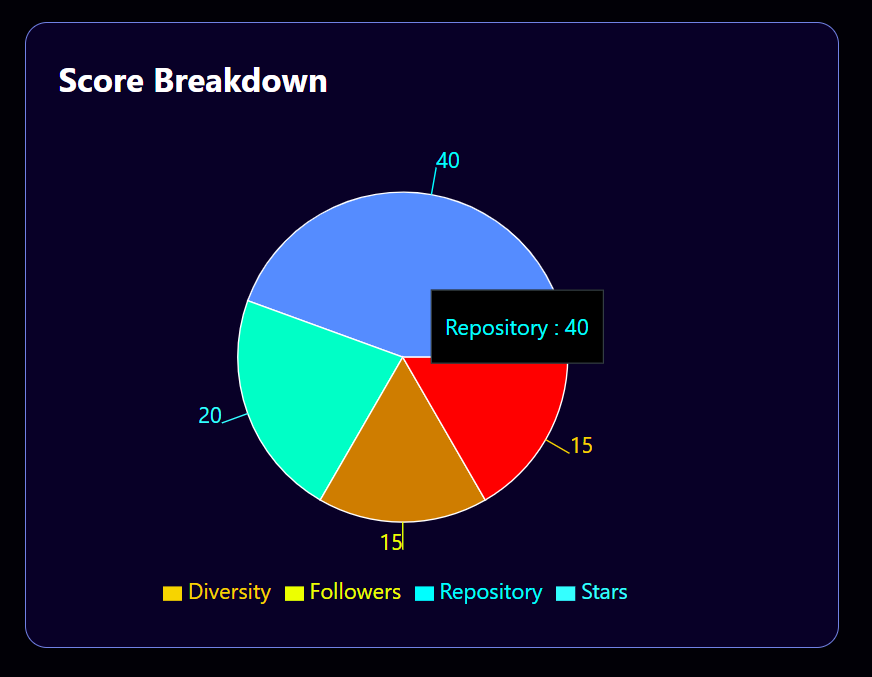

# 🚀 DevInsight - Developer Analytics Platform

<div align="center">


### Analyze Your Developer Journey Across Multiple Coding Platforms

A full-stack developer analytics platform that combines **GitHub**, **Codeforces**, and **LeetCode** data into a unified dashboard with interactive analytics, repository insights, historical tracking, and performance visualization.

### 🌐 Live Demo

**Frontend:**  
https://developer-productivity-platform.vercel.app

**Backend API:**  
https://devinsight-api-rrju.onrender.com

</div>

---

# 📖 Overview

DevInsight helps developers evaluate their programming profile by aggregating data from multiple platforms into one modern dashboard.

Instead of visiting GitHub, Codeforces, and LeetCode separately, DevInsight provides a single interface to analyze developer activity, repository statistics, competitive programming performance, and coding progress.

---

# ✨ Features

## GitHub Analytics

- Repository statistics
- Followers & Stars
- Fork count
- Most starred repository
- Top programming language
- Repository list
- GitHub profile information

---

## Codeforces Analytics

- Current Rating
- Maximum Rating
- Current Rank
- Maximum Rank
- Contribution
- Friend Count

---

## LeetCode Analytics

- Total Problems Solved
- Easy / Medium / Hard Solved
- Global Ranking
- Reputation
- Contest Rating
- Contest Participation

---

## Developer Score

A custom scoring algorithm evaluates developers using:

- Repository Count
- GitHub Stars
- Followers
- Language Diversity
- Codeforces Rating Bonus
- LeetCode Progress Bonus

---

## Analytics Dashboard

- Developer Summary
- Growth Statistics
- Historical Score Tracking
- Score Breakdown
- Repository Table
- Interactive Charts

---

## Historical Tracking

Every analysis stores a snapshot that enables:

- Developer score history
- Growth percentage
- Performance trend visualization

---

# 🏗 System Architecture

```
                     User
                       │
                       ▼
              React + Vite Frontend
                    (Vercel)
                       │
               REST API Requests
                       │
                       ▼
               FastAPI Backend
                   (Render)
                       │
      ┌────────────┬────────────┬────────────┐
      ▼            ▼            ▼
   GitHub API  Codeforces API  LeetCode API
                       │
                       ▼
                  SQLAlchemy
                       │
                  SQLite Database
```

---

# 🛠 Tech Stack

## Frontend

- React
- Vite
- Axios
- Tailwind CSS
- Recharts

---

## Backend

- FastAPI
- Python
- SQLAlchemy
- Requests
- Uvicorn

---

## Database

- SQLite

---

## Deployment

- Vercel
- Render

---

# 📂 Project Structure

```
Developer_Productivity_platform/

│
├── backend/
│   ├── database/
│   ├── models/
│   ├── routes/
│   ├── services/
│   ├── main.py
│   └── requirements.txt
│
├── frontend/
│   ├── src/
│   │   ├── components/
│   │   ├── services/
│   │   └── App.jsx
│   ├── package.json
│   └── vite.config.js
│
├── LICENSE
└── README.md
```

---

# 📸 Screenshots

## 🏠 Home Page

<p align="center">
  
</p>

---

## 📊 Analytics Dashboard

<p align="center">
  
</p>

---

## 📂 Repository Analytics

<p align="center">
  
</p>

---

## 📈 Developer Insights

<p align="center">
  
</p>
---

# ⚙ Installation

## Clone Repository

```bash
git clone https://github.com/vaddi-abhi/Developer_Productivity_platform.git

cd Developer_Productivity_platform
```

---

## Backend Setup

```bash
cd backend

python -m venv venv
```

### Windows

```bash
venv\Scripts\activate
```

### Linux / macOS

```bash
source venv/bin/activate
```

Install dependencies

```bash
pip install -r requirements.txt
```

Run backend

```bash
python -m uvicorn main:app --reload
```

---

## Frontend Setup

```bash
cd frontend

npm install
```

Create `.env`

```env
VITE_API_URL=http://127.0.0.1:8000
```

Run frontend

```bash
npm run dev
```

---

# 📡 API Endpoints

## Analytics

```
GET /analytics
```

Parameters

| Parameter | Description |
|------------|-------------|
| github | GitHub Username |
| cf | Codeforces Handle |
| leetcode | LeetCode Username |

---

## Repository List

```
GET /repositories/{username}
```

---

## GitHub Summary

```
GET /summary/{username}
```

---

## Developer History

```
GET /history/{username}
```

---

## Growth Analytics

```
GET /growth/{username}
```

---

# 🚀 Future Improvements

- Developer comparison dashboard
- PDF report generation
- Dark / Light mode
- Authentication
- PostgreSQL migration
- Docker support
- GitHub contribution heatmap
- Repository filtering & search
- Export analytics
- Organization analytics

---

# 🎯 Learning Outcomes

This project strengthened my understanding of:

- Full Stack Development
- REST API Integration
- React State Management
- FastAPI Backend Development
- Database Design
- SQLAlchemy ORM
- Deployment using Render & Vercel
- Environment Variables
- Git & GitHub Workflow
- API Error Handling

---

# 📜 License

This project is licensed under the MIT License.

---

# 👨‍💻 Author

**Abhi Vaddi**

GitHub: https://github.com/vaddi-abhi

LinkedIn: https://linkedin.com/in/abhi-vaddi-4b121b316

---

## ⭐ If you found this project useful, consider giving it a star!

